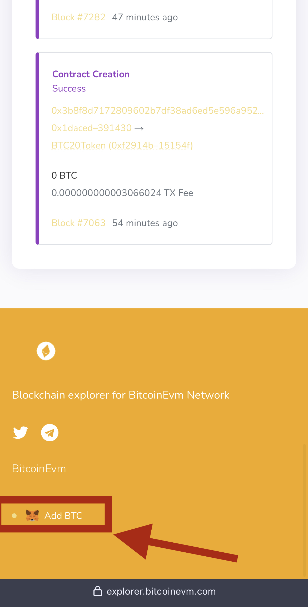

# 🔌 Connect Wallet To Bitcoin (Step 2)


Within Your Web3 [Wallet Browser ](web3-wallet-step-1/)Click Add BTC At The Bottom Of[ Block Explorer ](https://explorer.bitcoinevm.com)To Automatically Connect.


<figure><figcaption>
Scroll To The Bottom Of The <a href="https://explorer.bitcoinevm.com">Block Explorer</a> &#x26; Click Add BTC
</figcaption></figure>





## Bitcoin EVM Manual Connection Details: 

* **Network Name:** Bitcoin
* **RPC URL:** [**https://connect.bitcoinevm.com**](https://connect.bitcoinevm.com)​
* **Chain ID: 2203**
* **Symbol: BTC**
* **Block Explorer:** [**https://explorer.bitcoinevm.com**](https://explorer.bitcoinevm.com)
* **Logo URL**: [https://bitcoinevm.com/oophodes/2023/04/IMG\_1727.png](https://bitcoinevm.com/oophodes/2023/04/IMG\_1727.png)

### Step 3: Bridge Bitcoin


[bitcoin-bridge-step-3.md](bitcoin-bridge-step-3.md)

